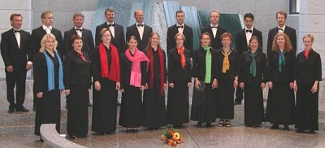
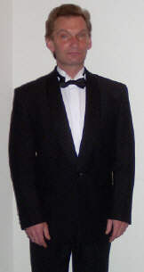

## Cantus Saimaa

Nykyisin noin 20 laulajan vahvuinen lappeenrantalainen
kamarikuoro Cantus Saimaa perustettiin syksyllä 1999.
Cantus Saimaan taiteellisena johtajana toimii Toomas
Kapten ja kuoroa harjoituttaa myös varajohtaja
Seppo Äikäs.

Cantus Saimaa esittää monipuolista ja
vaativaa kuoromusiikkia. Kuoron ohjelmistossa on
teoksia yli viideltä vuosisadalta hartaasta
humoristiseen. Cantus Saimaa on esiintynyt
kotipaikkakunnalla ja ulkomailla omissa konserteissaan
sekä yhteiskonserteissa eri kuorojen ja orkesterien
kanssa. Kuorolaisista kootut pienemmät lauluyhtyeet
ovat esiintyneet erilaisissa tilaisuuksissa, mm.
yritysten ja yhdistysten juhlissa. Vuosina 2003 ja
2005 Cantus Saimaa sai hopeisen leiman Tampereen Sävel
-kuorokatselmuksessa.

## Toomas Kapten

Professori Toomas Kapten (s.1957) on opiskellut Viron
Musiikkiakatemiassa ja Pietarin konservatoriossa
orkesterin-, kuoron- ja oopperamusiikin johtoa.
Valmistumisensa jälkeen hän on johtanut monia
orkestereita ja muun muassa Viron radiokuoroa
kotimaassaan sekä vieraillut säännöllisesti ulkomailla
kouluttajana, taiteellisena johtajana ja kilpailujen
tuomariston jäsenenä. Hänet on palkittu kotimaassaan
Vuoden muusikko- tittelillä, ja hänen johtamansa
orkesteri on kahdesti voittanut European Youth
Orchestra -kilpailun. Hän on ollut Eestin
Musiikkiakatemian kapellimestariosaston johtaja
vuodesta 1994 lähtien.

Kapellimestari Toomas Kapten on vieraillut 1990-luvun
alkupuolelta Etelä-Karjalassa kuorojen kouluttajana ja
johtajana. Hänen taiteellisella johdollaan
lappeenrantalaiset kuorot ja orkesterit ovat
esittäneet paikkakunnalla aikaisemmin kuulemattomia
vaikuttavia teoksia.

Vuonna 1999 hän perusti kamarikuoro Cantus Saimaan
esittämään taiteellisesti kunnianhimoista
kamarikuoro-ohjelmistoa.
