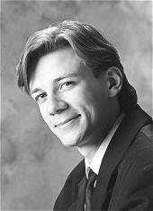

## Markku Mäkinen

Markku Mäkinen (s.1973) valmistui musiikin maisteriksi
Sibelius-Akatemian esittävän säveltaiteen koulutusohjelmasta 1999. Hän
suoritti A-tutkinnon erinomaisin arvosanoin urkujensoitossa 1998 prof.
Olli Porthanin johdolla ja cembalonsoitossa 2001 Kati Hämäläisen
oppilaana. Opintojaan hän on täydentänyt lukuisilla koti- ja
ulkomaisilla mestarikursseilla. Vuosina 1998-2000 hän jatkoi
urkujensoitonopintojaan Amsterdamin konservatoriossa prof. Jacques van
Oortmerssenin johdolla suorittaen Tweede fase -tutkinnon
(solistidiplomi) erityismaininnalla <i>cum laude</i>. 

Markku Mäkinen on konsertoinut solistina ja kamarimuusikkona Suomessa,
Ruotsissa, Virossa, Liettuassa, Alankomaissa, Venäjällä, Italiassa,
Isossa-Britanniassa, Itävallassa ja Espanjassa. Hän esiintyy
säännöllisesti useiden vanhan musiikin yhtyeiden, mm. Opus X:n ja
Baccanon, kanssa. Sibelius-Akatemian myöntämän ensikonserttinsa hän
antoi 1999 Kallion kirkossa Helsingissä. Lisäksi hän on tehnyt
nauhoituksia Yleisradiolle. Hän voitti 3. palkinnon Alkmaarin
kansainvälisessä Schnitger-urkukilpailussa Hollannissa 1997 ja 1.
palkinnon Kotkan kansainvälisessä urkukilpailussa 2002. Syksystä 2002
hän on opettanut urkujensoittoa ja kamarimusiikkia
Sibelius-Akatemiassa. Lisäksi hän on opettanut mestarikursseilla, mm.
Oundlen kansainvälisellä festivaalilla Englannissa, Tarton yliopiston
Viljandin kulttuuriakatemiassa Virossa ja Sibelius-Akatemian Kuopion
koulutusyksikössä. 

Maaliskuussa 2003 ilmestyi Markku Mäkisen ja Jan Lehtolan
Alba-levymerkille nauhoittama cd-levy Danse Sacrée (ABCD 169), joka
sisältää ranskalaista nelikätistä urkumusiikkia 1900-luvulta. Keväällä
2005 julkaistiin Mäkisen yhdessä italialaisen kollegansa Fabio
Ciofinin ja Opus X -yhtyeen kanssa Kotkan kirkossa nauhoittamat
J.S. Bachin konsertot kahdelle kosketinsoittimelle ja jousille (La
Bottega Discantica, Discantica 117). Lisäksi Mäkinen esiintyy
kamarimuusikkona useilla muilla levyillä. Lähitulevaisuudessa
julkaistaan myös Mäkisen Alba-levymerkille kesäkuussa 2004 Tampereen
tuomiokirkossa nauhoittama Sigfrid Karg-Elertin (1877–1933) musiikkia
sisältävä cd-levy. Julkaisemistaan odottavat myös syksyllä 2005
Janakkalan kirkon uruilla soitettu ohjelma pohjoissaksalaista
1600-luvun musiikkia ja Alba-yhtiölle yhdessä Petri Tapio Mattsonin ja
Eero Palviaisen kanssa nauhoitettu Georg Muffatin urkuteoksista ja
H.I.F. von Biberin viulukappaleista muodostuva kokonaisuus sekä
tammikuussa 2006 yhdessä Fabio Ciofinin kanssa nauhoitettu J.S. Bachin
ja hänen poikiensa kahden kosketinsoittimen konsertoille rakentuva
ohjelma.

