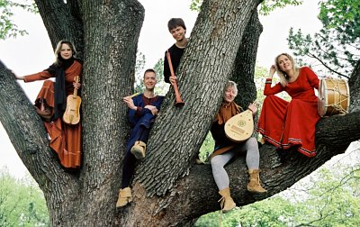

## Oliphant – Keskiaikaisen Musiikin Yhtye

- Uli Korhonen: laulu, sinfonia
- Eira Karlsson: fiidel, vetotrumpetti
- Leif Karlsson: luuttu, sinfonia, lyömäsoittimet
- Janek Öller: nokkahuilut, säkkipilli, pommeri

Oliphant-yhtye on perustettu vuonna 1995. Yhtyeen ohjelmisto kattaa
musiikkia 1100-luvun monodiasta aina moniääniseen ars novaan asti. 
Oliphant on tuonut runsaasti julki ennestään tuntematonta
truveerimusiikkia sekä tallentanut sitä levyilleen. Yhtyeen
improvisatorinen ja värikäs musisointi on herättänyt ihastusta niin
yleisössä kuin arvostelijoissakin. Levyt *Lauluja Ristiretkiltä*
vuodelta 2000 sekä Gace Brulén musiikkia sisältävä levy vuonna 2004
valittiin molemmat Helsingin Sanomien kulttuuritoimituksessa yhdeksi
vuoden levyksi klassisen musiikin sarjassa. Keväällä 06 ilmestyi
yhtyeen kolmas levy *Joie-fine*, mikä sisältää hurskaita Chanson
pieuse -lauluja 1200-luvulta. Oliphant levyttää Alba-records yhtiölle.

 
Oliphant on ollut kantavana voimana monessa musiikkitapahtumassa. 
Omien konserttiensa ja esiintymistensä lisäksi yhtye on ollut
toteuttamassa keskiaikaista liturgista draamaa, Ludus Danielis, sekä
kantaesittämässä myös uutta suomalaista musiikkia. Sen ohjelmistoon
sisältyy lauluja kokoelmista Carmina burana, Cantigas de Santa Maria
sekä lukuisia eriaiheisia truveerilauluja. Moniäänistä musiikkia
edustavat Guillaume de Machaut’n ja Francesco Landinin sävellykset
sekä ars antiquaan kuuluva ohjelmisto. Oliphantin toinen levy sisältää
yksinomaan truveeri Gace Brulén lauluja. Sitä varten yhtye on tutkinut
hänen koko tuotantonsa, kaikkiaan noin 90 laulua. Keskiaikaisen
ohjelmiston tutkiminen on oleellinen osa yhtyeen toimintaa.

 
Oliphant-yhtyeen muusikot soittavat omaleimaisella tyylillään useita
historiallisia soittimia. Yhtyeen perussoinnin muodostavat laulu,
fiideli, nokkahuilu, dulcimer ja keskiaikainen luuttu. Lisäksi
yhtyeellä on käytettävissään suuri osa niistä soittimista, joita
keskiajalta tunnetaan (skalmeija, pommeri, säkkipilli, vetotrumpetti,
sinfonia, kaksoishuilu, kellot, munniharppu sekä monenlaiset rummut ja
lyömäsoittimet). Eri soittimia pyritään käyttämään hyvällä maulla ja
harkiten. Oliphant-yhtyeen johtotähtinä ovatkin pythagoralainen
sävelpuhtaus sekä optimaalinen soitinten valinta.
 

Kotisivut: [www.ensembleoliphant.com](http://www.ensembleoliphant.com/)
