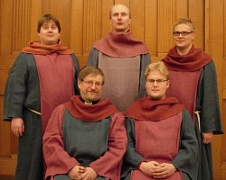

## Schola Sancti Henrici

Schola Sancti Henrici perustettiin vuonna 2000 Pyhän Henrikin
officiumin viettämistä varten. Officium toteutettiin Heikin päivänä
19.1.2000 Helsingin tuomiokirkossa. Ensiesiintymisensä jälkeen Schola
Sancti Henrici on esittänyt Pyhän Henrikin messun ja vesperin useasti
eri puolilla Suomea. Pyhän Henrikin päivänä vuonna 2001 yhtye lauloi
messun keskeiset osat Rooman Santa Maria Sopra Minerva -basilikassa
vietetyssä ekumeenisessa messussa, ja samalla matkalla se esiintyi
myös paavin vastaanotolla Vatikaanissa. Lisäksi yhtye on esiintynyt
useita kertoja Puolassa. Vuonna 2006 yhtye julkaisi CD-levyn 
*Patronus Finlandie*.

Schola Sancti Henrici on laajentanut ohjelmistoaan pääosin Suomessa
käytetyllä gregoriaanisella musiikilla sekä Graduale Romanumin
aineistolla. Yhtyeen ohjelmistoon kuuluu myös Pyhään Henrikiin
liittyvästä materiaalista koottu ohjelmakokonaisuus *Pyhän Henrikin
legenda*, jonka yhtye esittää tämän vuoden Vanhassa Vara Parempi!
-tapahtumassa. 

Schola Sancti Henricissä laulavat musiikin maisterit Jussi Hirvonen,
Samuli Korkalainen, Samppa Laakso ja Vesa Mäkeläinen sekä teologian
tohtori Hannu Vapaavuori. He kaikki ovat suorittaneet kirkkomuusikon
tutkinnon Sibelius-Akatemiassa.

