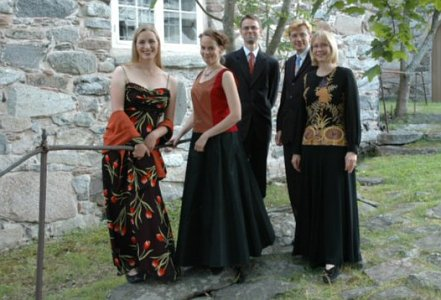

## Baccano

- Tuuli Lindeberg, sopraano 
- Hanna Haapamäki, nokkahuilu 
- Mervi Kinnarinen, viulu 
- Jussi Seppänen, sello 
- Markku Mäkinen, cembalo ja urut

Aikakauden soittimia käyttävä Baccano-barokkiyhtye on viime
vuosina esiintynyt laajalti ympäri Suomea, mm. Helsingissä
Sibelius-Akatemian Soiva Akatemia -konserttisarjassa, Espoossa,
Lahdessa, Tampereella ja Tuusulassa. Sen jäsenet ovat yhdessä ja
erikseen esiintyneet merkittävimmillä kotimaisilla musiikkijuhlilla,
konsertoivat eri yhtyeiden jäseninä ympäri Eurooppaa ja soittavat mm. maamme vanhan musiikin orkestereiden soolosoittajina.

Viime vuonna Baccanoa kuultiin mm. Suomen Solistiyhdistyksen
konserttisarjassa Helsingissä, Uudenkaupungin Crusell-viikolla,
Oulunsalo Soi -musiikkijuhlilla, Vantaan Barokissa ja Keravan
Helmimusiikkia-konserttisarjassa.
