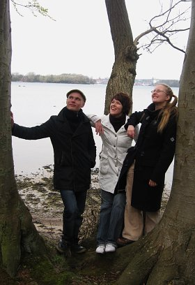

## Ensemble Recordanza

Ensemble Recordanza -yhtyeen jäsenet (Sunniva Fagerlund, Louna
Hosia ja Petteri Pitko) ovat soittaneet yhdessä vuodesta 2004 lähtien. 
Imatran konsertissa Petteri Pitkon tilalla soittaa Anna-Maaria Oramo. 

Ensimmäisinä vuosina jäsenet esiintyivät omilla nimillään,
ja nimi Ensemble Recordanza otettiin käyttöön vasta syyskuussa 2006. 
Inspiroivana lähteenä nimelle toimi Sebastian Fagerlundin säveltämä
teos Recordanza (2005) tenorinokkahuilulle. 

Yhtyeen jäsenet, jotka ovat nuoria periodisoittimiin perehtyneitä
taiteilijoita, ovat opiskelleet Sibelius-Akatemiassa, Helsingin
Stadiassa sekä ulkomailla mm. Saksassa ja Espanjassa. He ovat myös
täydentäneet opintojaan lukuisilla mestarikursseilla ympäri Eurooppaa.

Yhtyeen ohjelmisto on monipuolinen ja ulottuu varhaisbarokista
tämän päivän musiikkiin. Säveltäjistä voidaan mainita Bach, Händel,
Telemann, Mealli, Frescobaldi, sekä kotimaiset Jukka Tiensuu, Eero
Hämeenniemi ja Sebastian Fagerlund. Ensemble Recordanza konsertoi
aktiivisesti Suomessa sekä ulkomailla, ja yhtye on Suomen lisäksi
esiintynyt mm. Tanskassa ja Saksassa.
