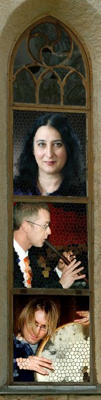

## Fioretto Ensemble

- Debra Gomez-Tapio, harput ja laulu
- Janek Öller, nokkahuilut ja säkkipilli
- Mikael Heikkilä, lyömäsoittimet

Yhtyeen taiteellisena johtajana toimii Gomez-Tapio, joka on saanut
koulutuksensa New Yorkin Sarah Lawrence Collegessa ja Baselin Schola Cantorumissa.
<!-- Jälkimmäisessä hänen opettajinaan ovat olleet mm. René
Jakobs ja Montserrat Figueras. Keskieuroopan vuosinaan Gomez-Tapio
esiintyi ja levytti aktiivisesti useissa vanhan musiikin
kokoonpanoissa, mm. <i>Ferrara Ensemblessa, Sequentiassa ja Ensemble
Retroverissa</i>. Nykyisin hän asuu vakituisesti Suomessa, opettaa, johtaa
kuoroja ja keskiajan ja renessanssin musiikkiin ja tanssiin
keskittynyttä Fioretto Ensemblea. Kaudella 2007 hän työskentelee
Pirkanmaan taidetoimikunnan työskentelyapurahalla.
-->

Nokkahuilisti Janek Öller on saanut koulutuksensa
Sibelius-Akatamiassa ja Milanossa. 
<!-- Hänet tunnetaan myös toisen
suomalaisen keskiaikayhtyeen <i>Oliphantin</i> ja nokkahuiluyhtye
<i>Tuulen viemää</i> perustajajäsenenä. Öller on aktiivinen kamarimuusikkona
ja opettajana sekä Suomessa että Italiassa. 
-->
Öllerin toinen instrumentti on säkkipilli.

Lyömäsoittaja Mikael Heikkilä on valmistunut
lyömäsoitinpedagogiksi Tampereen konservatoriosta vuonna 2004 ja
opiskellut sen jälkeen Toronton yliopistossa.
<!-- Klassisten
lyömäsoitinten lisäksi hän on perehtynyt kansanmusiikkiin ja
erilaisiin etnisiin rumpuihin, kuten länsiafrikkalaiseen djembeen,
erilaisiin kehärumpuihin sekä tamburiineihin. Heikkilä työskentelee
free lance -muusikkona ja on nykymusiikkia esittävän lyömäsoitinyhtye
Osuma Ensemblen jäsen. -->

Fioretto Ensemble syntyi vuonna 1997, kun yhdysvaltalaissyntyinen
Debra Gomez-Tapio asettui vakituisesti Suomeen. Yhdessä
historiallisten tanssien spesialistien Mirja-Liisa Herhin ja Antti
Talvion kanssa hän alkoi suunnitella ja toteuttaa keskiaikakonsertteja
ja keskiaikaisia pitoja eri puolilla Suomea. Kesällä 2007 Fioretto
kiertää Hämeen Härkätien varrella Turun seudulta Hämeenlinnaan omalla
konserttisarjallaan. Heidän kiertueohjelmassaan on sekä muusikkovoimin
toteutettavia kirkkokonsertteja, että näyttäviä tanssikonsertteja. 
Kuluvan kauden aikana Fioretto on konsertoinut myös Yhdysvalloissa ja
Brasiliassa.
