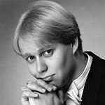

## Teppo Lampela

Teppo Lampela on opiskellut Sibelius-Akatemiassa Marjut Hannulan
oppilaana sekä useilla mestarikursseilla mm. Evelyn Tubbin, Michael
Fieldsin, Andreas Schollin, Kevin Smithin, Carl Høgsetin sekä Oren
Brownin johdolla. Hän on vuoden 2005 Lohjan Tenorikilpailujen
voittaja.

Laajalle yleisölle hän on tullut tutuksi mm. kysyttynä Bachin,
Händelin, Mozartin, Pergolesin, Buxtehuden ja Pärtin musiikin
tulkkina. Näyttämöllä häntä on kuultu mm. Apollon roolissa Mozartin
Apollo et Hyacinthus -oopperan Suomen kantaesityksessä
Sibelius-Akatemiassa, sekä Oberonin roolissa Brittenin oopperassa A Midsummer Night’s Dream Helsingin ammattikorkeakoulussa Stadiassa. 
Syksyllä 2005 hän esiintyi Tukholmassa Bachin h-mollimessussa Fredrik
Malmbergin johdolla.

Hänen laajaan alttosolisti-repertoaariinsa kuuluvat kaikki
merkittävimmät kirkkomusiikkiteokset: J.S.Bachilta mm. 
Johannes-Passio, h-mollimessu, Pääsiäisoratorio, Magnificat,
Jouluoratorio sekä lukuisia kantaatteja, Händelin Messias- ja
Jephtha-oratoriot, Mozartin Requiem sekä G-duuri- ja d-molli-messut. 
Muita merkittäviä soolotehtäviä Lampelalla on ollut mm. Purcellin The Fairy Queenissä, Pergolesin Stabat Materissa, Buxtehuden Membra Jesu Nostrissa sekä useissa varhaisbarokin kantaateissa.
