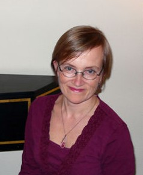

## Annamari Pölhö

Annamari Pölhö aloitti musiikkiopintonsa pianolla, mutta kiinnostui cembalosta 15-vuotiaana. Cembalo pääaineenaan hän opiskeli Sibelius-Akatemiassa vuosina 1984-1989 viettäen siinä välissä muutaman vuoden myös Glen Wilsonin ja Siebe Henstran oppilaana Utrechtin Konservatoriossa. 1989 hän suoritti solistidiplomin molemmissa oppilaitoksissa valmistuen samalla myös musiikin maisteriksi. Opinnot eivät kuitenkaan päättyneet siihen vaan jatkuivat mestarikurssien merkeissä ja huipentuivat tohtoraattiin Sibelius-Akatemiasta 1994. Annamari Pölhö sai Vantaan ”Barokki Energiaa” -palkinnon 2004.

Hän toimii vanhan musiikin lehtorina Helsingin Ammattikorkeakoulu Stadiassa sekä free-lance muusikkona pienyhtyeissä ja orkestereissa (mm. The Harp Consort, Kuudes kerros orkesteri), opettaa continuosoittoa Sibelius-Akatemiassa ja esiintyy sooloresitaalein, duona [Petra Aminoffin](../petra-aminoff/) kanssa sekä Battalian kosketinsoittajana. Lukuvuoden 2007–2008 Annamari Pölhö keskittyi taiteelliseen työskentelyyn Suomen Kulttuurirahaston 1-vuotisen apurahan turvin.
