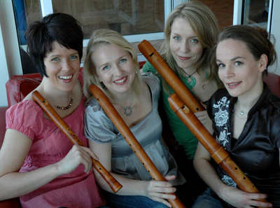

## Bravade

Bravade on nuorista ammattilaisista koostuva nokkahuilukvartetti, joka aloitti toimintansa vuonna 2004. Bravaden muusikot ovat opiskelleet vanhaa musiikkia Sibelius-Akatemiassa ja Stadiassa sekä Hollannissa ja Saksassa. Opintojaan he ovat täydentäneet useilla mestarikursseilla.

Kvartetin ohjelmistossa on musiikkia keskiajalta nykypäivään, säveltäjäniminä mm. Orlande di Lassus, J. S. Bach, Matthew Locke, Lotta Wennäkoski ja Henrik Marstrander. Bravade toimii aktiivisesti myös lastenkulttuurin saralla konsertoimalla mukaansatempaavalla Hajamielinen säveltäjä ystävineen –esityksellä kouluissa kautta maan.

Bravade-nokkahuilukvartetti on konsertoinut laajalti kotimaassamme  mm.  seurakuntien konserttisarjoissa, Lahdessa Hubertuksen soitto-sarjassa sekä Katedraali soi! -konserttisarjassa Turussa. Tulevana kesänä Bravadea voi kuulla Korsholman musiikkijuhlilla, Vantaan Barokissa sekä Vanhassa Vara Parempi -festivaalilla Imatralla.
