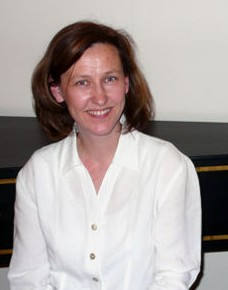

## Petra Aminoff

Petra Aminoff opiskeli Sibelius-Akatemiassa nokkahuilu pääaineenaan. Suoritettuaan nokkahuiludiplomin vuonna 1986 hän jatkoi opintojaan Haagin konservatoriossa ja aloitti myös traverson soiton. Lukuvuonna 1989–1990 hän opiskeli traversoa Utrechtin konservatoriossa Marten Rootin johdolla. 
Sibelius-Akatemiasta hän valmistui musiikin maisteriksi vuonna 1991, ja traversoensikonsertin aika oli vuonna 1996.

Aminoff soittaa lukuisissa vanhan musiikin yhtyeissä ja orkestereissa silloin, kun huiluja tarvitaan, muun muassa Kuudennen kerroksen orkesterin Beethoven-sarjassa soolohuilistina. Erilaiset kamarimusiikkikokoonpanot (Opus X, Battalia ja viimeisimpää Sama-yhtyeen uudet barokkiviulukonsertot -projekti) ovat lähellä sydäntä. Hän toimii Espoon musiikkiopiston nokkahuilunsoiton lehtorina, mutta oli virkavapaalla Suomen Kulttuurirahaston apurahan turvin lukuvuoden 2007–2008.
