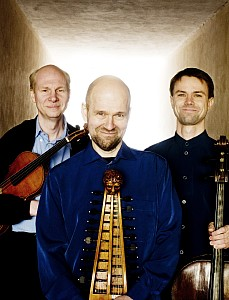

## Suomalainen Barytontrio

Suomalainen Barytontrio teki ensiesiintymisensä vuonna 2002 Kuopiossa. Sen jälkeen yhtye on konsertoinut ja tehnyt nauhoituksia mm. Yleisradiolle ohjelmiston kulmakiviin luonnollisesti kuuluvilla Joseph Haydnin barytontrioilla. Trion ensimmäinen cd julkistetaan vuonna 2009. Yhtyeessä soittavat Markus Kuikka (baryton), Markus Sarantola (alttoviulu) ja Jussi Seppänen (sello). Tuleviin haasteisiin kuuluu konsertit kesän kotimaisilla festivaaleilla ja myöhemmin Saksassa.
