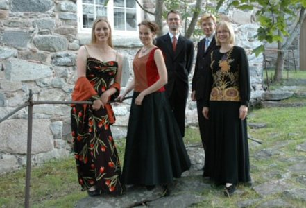

## Baccano

- Hanna Haapamäki, nokkahuilu 
- Mervi Kinnarinen, viulu 
- Jussi Seppänen, sello 
- Eero Palviainen, luuttu
- Markku Mäkinen, cembalo ja urut

Aikakauden soittimia käyttävä Baccano-barokkiyhtye on
esiintynyt laajalti ympäri Suomea, sen jäsenet ovat yhdessä ja
erikseen esiintyneet merkittävimmillä kotimaisilla
musiikkijuhlilla, konsertoivat eri yhtyeiden jäseninä ympäri
Eurooppaa ja soittavat mm. maamme vanhan musiikin orkestereiden
soolosoittajina.

Baccanoa on kuultu mm. Sibelius-Akatemian ja Suomen
Solistiyhdistyksen konserttisarjoissa Helsingissä,
Uudenkaupungin Crusell-viikolla, Oulunsalo Soi
-musiikkijuhlilla, Vantaan Barokissa, Kymijoen Lohisoitossa,
Kaustisen Kamarimusiikkiviikolla ja Espoon Sellosalissa.

Tänä vuonna yhtye esiintyy mm. Kirkko soikoon -festivaalilla
Helsingissä, Paraisten Urkupäivillä, Kauniaisten Nya
Paviljongenissa ja Tampere-talossa. Syksyllä 2008 yhtye äänitti
levyllisen napolilaista barokkimusiikkia.