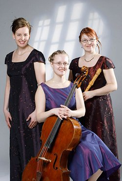

## La Fiabe

Le Fiabe -barokkiyhtye perustettiin vuonna 2002. Kokoonpanoon
kuuluvat nokkahuilisti Satu Parkkonen, barokkisellisti Louna
Hosia ja cembalisti Anna Hämäläinen. Yhtyeen laulajana toimi
vuoteen 2008 Satu Klemi. Kesästä 2008 alkaen yhtye on
esiintynyt sopraano Katja Juholan kanssa.

Le Fiaben ohjelmisto koostuu varhaisbarokin ja täysbarokin
vokaali- ja soitinmusiikista. Yhtye esiintyy konsertin aikana
vaihdellen kokoonpanoa, sooloista yhteisiin obligatoaarioihin.

Kaikki yhtyeen jäsenet ovat opiskelleet Sibelius-Akatemiassa ja
asuvat pääkaupunkiseudulla. Le Fiabe on konsertoinut
aktiivisesti eri puolilla Suomea.