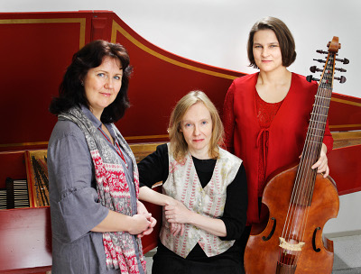

## Regina Caeli

- [Pia Freund](#pia-freund), sopraano
- [Assi Karttunen](#assi-karttunen), cembalo
- [Varpu Haavisto](#varpu-haavisto), viola da gamba

### <a name="pia-freund">Pia Freund</a>

Sopraano Pia Freund opiskeli ensin Turun konservatoriossa,
josta hän siirtyi vuonna 1991 Sibelius-Akatemian
oopperakoulutuslinjalle. Yksinlaulua hänelle opettivat
vuorollaan Ritva Auvinen ja Soile Isokoski.

Pia Freund voitti Timo Mustakallion -laulukilpailun
heinäkuussa 1991; Kangasniemen laulukilpailu päättyi samana
vuonna yhtä voitokkaasti.

Tammikuussa 1992 hän voitti Lappeenrannan laulukilpailun,
saaden kohta Hämeenlinnan kaupungin kulttuuripalkinnon ja
Sibelius-seuran Sibeliuspalkinnon.

Pia Freundin konserttiohjelmisto ulottuu barokista
nykymusiikkiin. Nimekkäiden kapellimestareiden kanssa hän on
tehnyt runsaasti yhteistyötä - Esa-Pekka Salonen, Jukka-Pekka
Saraste, Ralf Gothoni jne. - sekä esiintynyt huomattavien
orkestereiden solistina.

Pia Freund on esittänyt erityisesti Kaija Saariahon
tuotantoa; oopperan Kaukainen Rakkaus Clémencen rooli Bergenin
festivaaleilla Norjassa; La Passion de Simone -oratorion
kantaesitys Wienin New Crowned Hope -festivaaleilla 2006 sekä
Adriana Mater -oopperan Refka Suomen Kansallisoopperan lisäksi
Santa Fen musiikkijuhlilla USA:ssa 2008.

Kaija Saariahon teosten lisäksi sopraanon rooliluetteloon
kuuluvat mm. Mozartin Taikahuilun Pamina sekä Cosi fan
tutte -oopperan Fiordiligi. Myös Giacomo Puccinin oopperan La
Bohemen Mimi ja Bizet’n Carmenin Micaèla ovat saaneet Pia
Freundista oivan tulkin.

Pia Freund on levyttänyt Ondine- ja Finlandia
Records -levymerkeille sekä tehnyt lukuisia TV- ja
radionauhoituksia.

### <a name="assi-karttunen">Assi Karttunen</a>

Assi Karttunen suoritti vuonna 1994 A-tutkinnon
Sibelius-Akatemiasta cembalo pääaineenaan. Opettajina hänellä
oli Sibelius-Akatemiassa mm. Anssi Mattila ja Elina Mustonen.
Vuoden 1994-95 hän vietti Tanskassa opiskellen Lars Ullrik
Mortensenin (cembalisti, nyk. Concerto Copenhagenin
taiteellinen johtaja) johdolla. Hän on myös viettänyt aikaa
Pariisissa opiskellen yksityisesti Pierre Hantaļn johdolla.

Vuonna 1995-96 Karttunen soitti EUBO:n (European Union Barock
Orchestra) kiertueilla eri puolilla Eurooppaa ja mm. Marokossa
ja Maltalla, ja osallistui orkesterin cembalistina ja urkurina
Bachin Markus-passion rekonstruktion levytykseen vuonna 1996.

Kotimaassa Karttunen kuuluu Kuudennen kerroksen
barokkiorkesteriin, mutta soittaa monissa muissakin
barokkikokoonpanoissa ja kamariorkestereissa. Hän on soittanut
Kuudennen kerroksen barokkiorkesterin, Vox Artisin, Finlandia
Sinfoniettan, Tampereen ja Lahden orkesterien solistina,
esiintynyt soolocembalistina monilla festivaaleilla ja  YLE:n
sekä FST:n televisio-ohjelmissa. Hän on osallistunut muusikkona
Taite ry:n produktioihin, kuten Rebelin Ulysse, Gluckin Orfeus
ja Eurydike, Bachin kantaatteihin pohjautuva Herkules ja
poikkitaiteelliseen Poimin kaksitoista hedelmää -esitykseen.

Karttusen soololevy, Ariosa, varhaista italialaista
cembalo-ohjelmistoa Jubal -levymerkille ilmestyi vuonna 1999.
Uusi CD nimellä Memento mori Froberger ilmestyi
Alba-levymerkillä vuonna 2005. Vuodesta 2002 Karttunen opiskeli
Sibelius-Akatemian DocMus-osastolla ja valmisti
jatkotutkintoaan myös Vest-tutkijakoululaisena. Hän suoritti
musiikin tohtorintutkinnon syksyllä 2006. Karttunen opettaa
cembalon soittoa ja basso continuoa mm. Länsi-Helsingin
musiikkiopistossa ja Sibelius-Akatemiassa.

### <a name="varpu-haavisto">Varpu Haavisto</a>

Varpu Haavisto suoritti sellonsoiton diplomin vuonna 1990 ja
valmistui musiikin maisteriksi Sibelius-akatemiasta vuonna 1993. Gambansoittoa ja vanhaa musiikkia hän opiskeli
Sibelius-akatemiassa vuosina 1986-96. Vuonna 1996 hän suoritti
gambansoiton ja vanhan musiikin yhtyesoiton diplomit
Sibelius-akatemiassa erinomaisin arvosanoin. Hän on opiskellut
gambansoittoa lisäksi useilla mesterikursseilla sekä
yksityisesti Lontoossa Lawrence Dreyfusin johdolla.

Varpu Haavisto esiintyy aktiivisesti sekä soolokonsertein että
yhtyemuusikkona useissa suomalaisissa vanhan musiikin yhtyeissä
ja on perustajajäsen Verso-triossa, jossa hänen lisäkseen
soittavat Petri Mattson ja Assi Karttunen. Hän soittaa
yhtyemuusikkona useissa vanhan musiikin levytyksissä ja on
tehnyt useita nauhoituksia Yleisradiolle. Kesällä 2001 hän
levytti yhdessä kansainvälisen Phantasm-yhtyeen kanssa
W. Lawesin 6-ääniset fantasiat. Joulukuussa 2001 hän debytoi
Sibelius-akatemian Soiva akatemia -sarjassa. Hän opettaa
sellon- ja gambansoittoa sekä vanhaa musiikkia Pirkanmaan
ammattikorkeakoulussa ja Pirkanmaan musiikkiopistossa.
