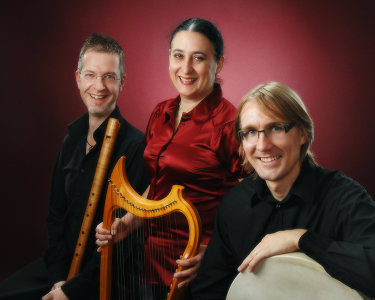

## Fioretto Ensemble

- Janek Öller, nokkahuilut ja säkkipilli
- Debra Gomez-Tapio, harput ja laulu
- Mikael Heikkilä, lyömäsoittimet

Yhtyeen taiteellisena johtajana toimii Gomez-Tapio, joka on saanut
koulutuksensa New Yorkin Sarah Lawrence Collegessa ja Baselin Schola
Cantorumissa.

Nokkahuilisti Janek Öller on saanut koulutuksensa
Sibelius-Akatamiassa ja Milanossa.  Öllerin toinen instrumentti on
säkkipilli.

Lyömäsoittaja Mikael Heikkilä on valmistunut
lyömä­soitin­pedagogiksi Tampereen konservatoriosta vuonna 2004 ja
opiskellut sen jälkeen Toronton yliopistossa.

Fioretto Ensemble syntyi vuonna 1997, kun yhdysvaltalais­syntyinen
Debra Gomez-Tapio asettui vakituisesti Suomeen. Yhdessä
historiallisten tanssien spesialistien Mirja-Liisa Herhin ja Antti
Talvion kanssa hän alkoi suunnitella ja toteuttaa keski­aika­konsertteja
ja keskiaikaisia pitoja eri puolilla Suomea.
