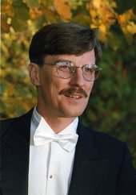

## Heikki Kulo

Heikki Kulo valmistui musiikin maisteriksi Sibelius-Akatemiasta 1997,
missä hän suoritti sellonsoiton ja laulun loppututkinnot erinomaisin
arvosanoin. Hänen lauluopettajinaan toimivat Anssi Hirvonen ja Erkki
Rajamäki. Kulo jatkoi lauluopintojaan Englannissa ja Itävallassa,
kamarilaulaja Kurt Equiluzin johdolla; sekä on osallistunut useille
mestarikursseille.

Laulajana Kulo on esiintynyt oratoriosolistina
Suomessa, Itävallassa ja Virossa ja on kantaesittänyt ja levyttänyt
uutta suomalaista musiikkia. Hän toimi myös useita vuosia radion
kamarikuorossa. Nykyisin Kulo esiintyy eri lauluyhtyeissä ja toimii
sellonsoiton ja yhteissoiton opettajana Keskisen Uudenmaan ja Keravan
musiikkiopistoissa. Lauluensikonserttinsa Heikki Kulo piti vuonna 2000
Sibelius-Akatemiassa.
