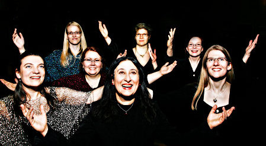

## Lumous

Vokaaliyhtye Lumous on seitsemän naislaulajan kokoonpano, jota kiehtoo
keskiajan ja renessanssin mystinen, värikäs musiikki. Lumous kertoo
konserteissaan tarinoita menneitten aikojen elämästä. Niissä kuljetaan
pyhiinvaeltajien matkassa kohti Santiago de Compostelaa, seurataan
voimanaisten elämänkohtaloita, astutaan luostarin hiljaisuuteen ja
kuullaan balladeja linnojen liepeiltä. Yhtyeen herkkä, vahva ja
värikylläinen sointi kietoo kuulijansa tarinoitten
lumoukseen.

Lumouksen taiteellisena johtajana toimii
newyorkilaissyntyinen harpisti-laulaja Debra Gomez-Tapio. Hänen
lisäkseen Lumouksessa laulavat sopraanot Kaisa Koskinen, Esther Schütz
ja Elina Orjatsalo, mezzosopraanot Mari Sares ja Johanna Laukkanen
sekä kontra-altto Elina Aho-Kuusama. Yhtye esiintyy vaihtelevissa 4-7
laulajan kokoonpanoissa kulloisenkin ohjelman mukaan.
