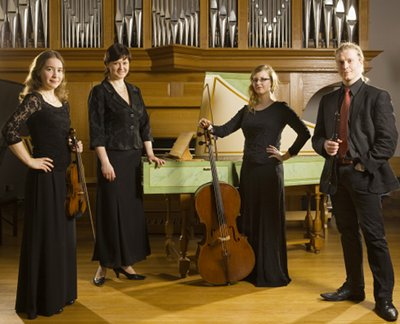

## Un'altra ondata

- Saana Uksila, barokkiviulu
- Julia tamminen, cembalo
- Louna Hosia, barokkisello
- Petri Arvo, nokkahuilu

Un'altra ondata on toukokuussa 2009 perustettu vanhan musiikin
yhtye, jonka jäsenet ovat nuoria vastavalmistuneita ja valmistumassa
olevia musiikin taiteilijoita. Oman solistisen taiteellisen
työskentelyn lisäksi he ovat omistautuneet barokin ajan
alkuperäis-repertuaarin omaperäiseen esittämiseen ja sovittamiseen, ja pyrkivät luomaan uusia konsepteja ja näkökulmia jo tunnettuunkin
aineistoon.

Yhtyeen jäsenillä on vankka koulutustausta sekä
Sibelius-Akatemian esittävän säveltaiteen koulutusohjelmasta että
Pietarin ja Amsterdamin konservatorioista. Heillä on
esiintymiskokemusta ja kilpailumenestystä sekä solisteina että
kamarimuusikkoina niin Suomen kuin monien muidenkin Euroopan maiden
lavoilta.
