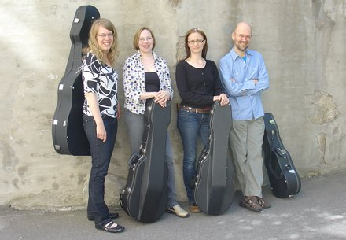

## UntoConsort

UntoConsort teki ensiesiintymisensä Kuopion Taidemuseossa maaliskuussa 1997. Nimensä se on saanut kuopiolaisen viulunrakentaja Unto Hakkaraisen mukaan, joka rakensi ensimmäiset yhtyeen soittimet. Ensimmäisestä esiintymisestä alkaen jatkunut yhtyeen toiminta on sittemmin siirtynyt Helsinkiin.

Suomen Kulttuurirahaston apurahan tukemana yhtye on hankkinut
Tilman Muthesiuksen (Potsdam) rakentamat, 1600-luvulla eläneen
englantilaisen gambanrakentaja Henry Jayen malleja noudattavat uudet
soittimet. Suomen Kulttuurirahaston Pohjois-Savon rahasto puolestaan
tuki UntoConsortia jousten hankinnassa.

Yhtye esiintyy pääasiassa omin konsertein, mutta on avustanut
kuoroja eri kirkkomusiikkiteosten, kuten kantaattien ja messujen
esityksissä.

Yhtyeen johtajana toimii Markus Kuikka ja sen jäsenet Maija Lampela,
Ritva Hautsalo, Katri Susitaival ovat vanhan musiikin ammattilaisia.

UntoConsortin ohjelmisto on enimmäkseen 1600-luvun englantilaista
musiikkia, jonka säveltäjistä tänään kuultavat teokset antavat
edustavan kuvan. UntoConsort sai tänä vuonna Valtion
säveltaidetoimikunnalta konsertointia varten apurahan, jonka turvin se
konsertoi tulevana syksynä kahdesti Helsingissä ja kerran Tampereella.  
