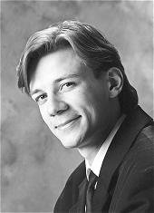

## Markku Mäkinen

Markku Mäkinen (s.1973) valmistui musiikin maisteriksi
Sibelius-Akatemian esittävän säveltaiteen koulutusohjelmasta 1999. Hän
suoritti A-tutkinnon erinomaisin arvosanoin urkujensoitossa 1998 prof.
Olli Porthanin johdolla ja cembalonsoitossa 2001 Kati Hämäläisen
oppilaana. Opintojaan hän on täydentänyt lukuisilla koti- ja
ulkomaisilla mestarikursseilla. Vuosina 1998-2000 hän jatkoi
urkujensoitonopintojaan Amsterdamin konservatoriossa prof. Jacques van
Oortmerssenin johdolla suorittaen Tweede fase -tutkinnon
(solistidiplomi) erityismaininnalla *cum laude*. 

Markku Mäkinen on konsertoinut solistina ja kamarimuusikkona Suomessa,
Ruotsissa, Tanskassa, Virossa, Liettuassa, Alankomaissa, Venäjällä,
Italiassa, Isossa-Britanniassa, Itävallassa, Espanjassa ja Unkarissa.
Hän esiintyy säännöllisesti useiden vanhan musiikin yhtyeiden, mm.
Baccanon ja italialaisen Accademia Barocca Willem Hermansin, kanssa.

Sibelius-Akatemian myöntämän ensikonserttinsa hän antoi 1999 Kallion
kirkossa Helsingissä. Lisäksi hän on tehnyt nauhoituksia
Yleisradiolle. Mäkinen on tehnyt myös useita levytyksiä niin solistina
kuin kamarimuusikkona, mm. levymerkeille Alba ja La Bottega
Discantica.

Hän voitti 3. palkinnon Alkmaarin kansainvälisessä
Schnitger-urkukilpailussa Hollannissa 1997 ja 1. palkinnon Kotkan
kansainvälisessä urkukilpailussa 2002. Syksystä 2002 hän on opettanut
urkujensoittoa Sibelius-Akatemiassa. Lisäksi hän on opettanut
mestarikursseilla, mm. Oundlen kansainvälisellä festivaalilla
Englannissa, Tarton yliopiston Viljandin kulttuuriakatemiassa Virossa
ja Sibelius-Akatemian Kuopion koulutusyksikössä. Vuodesta 2007 Mäkinen
on toiminut Kansainvälisen kirkkomusiikin kesäakatemian taiteellisena
johtajana Virossa. Mäkinen toimii myös Helsingissä katolisen Pyhän
Marian kirkon urkurina.
