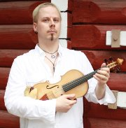

## Petri-Tapio Mattson

Petri Tapio Mattson on opiskellut viulunsoittoa ja vanhan musiikin
esittämistä Sibelius-Akatemiassa 1992-1999, opettajina mm. Grazyna
Gebert, Kreeta-Maria Kentala and prof. Jaap Schröder. Vuosina
1987-1994 opintoja täydensivät mestarikurssit opettajina mm. Zoria
Shikmurzajeva, David Kim, Gottfried Schneider, Adriano Chamorro,
Charles Toet, Sigiswald Kuijken ja Konrad Hünteler. Diplomi
barokkiviulunsoitossa (ensimmäinen laatuaan Sibelius-Akatemiassa)
valmistui erinomaisin arvosanoin prof. Schröderin johdolla keväällä 1999. Ensikonserttinsa Petri Tapio Mattson piti Sibelius-Akatemian
konserttisarjassa syksyllä 2000.

Petri Tapio Mattson on tullut tutuksi vanhan musiikin yleisöille mm.
perustamansa Opus X -yhtyeen taiteellisena johtajana ja ensiviulistina
ja Kuudennen kerroksen orkesterin (nyk. Suomalainen barokkiorkesteri)
konserttimestarina (1999-2005). Hän on esiintynyt myös mm. Helsingin
Barokkiorkesterin, Suomalais-Virolaisen barokkiorkesterin, Tallinnan
barokkiorkesterin, Lappeenrannan kaupunginorkesterin ja Haapaveden
kamariorkesterin konserttimestarina ja sooloviulistina.

Mm. edellä mainittujen kokoonpanojen ja eri kamarimusiikkipartnereiden
kanssa Petri Tapio Mattson on esiintynyt eri puolilla Suomea ja
useimmissa läntisen Euroopan maissa. Hän on tehnyt parisenkymmentä
levytystä eri levymerkeille (mm. BIS, Ondine, Alba, Naxos); näistä
useat ovat saaneet kiitosta kansainvälisesti. Barokkiviulun lisäksi
Petri Tapio Mattson on esiintynyt barokkialttoviulun ja viola da
gamban soittajana, harjoittaa soitinrakennusta sekä säveltää omaa
musiikkia jossa heavy metaliin yhdistyy folk- ja renessanssivaikutteita.