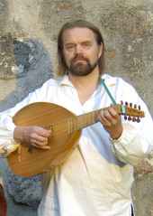

## Timo Peedu

Timo Peedu (s. 1955) on opiskellut luutunsoittoa Helsingin
konservatoriossa Leif Karlsonin johdolla ja Baselin Schola Cantorum
Basilienisissa, jossa hän opiskeli luutunsoiton lisäksi myös keskiajan
ja renessanssin musiikin teoriaa ja esityskäytäntöä opettajinaan Eugen
Dombois, Crawford Young, Thomas Binkley, Dominic Veillard ja Randall
Cook.

Hän on konsertoinut lukuisten yhtyeiden kanssa eri puolilla Eurooppaa.
Tärkeimmistä mainittakoon Project Ars Nova, Ensemble D’Este,
Lucidarium, Trouveres ja Ferrara Ensemble.

Hän on tehnyt Yleisradiolle kantanauhoja ja levyttänyt Alexander
Agricolan musiikkia Ferrara Ensemblen kanssa.

Tällä hetkellä hän toimii musiikillisena johtajana keskiajan ja
varhaisrenessanssin musiikkia esittävässä Elysium-yhtyeessä sekä
Renessanssin ja varhaisbarokin musiikkiin erikoistuneessa
Zephiro-yhtyeessä. Hän vierailee myös vakituisesti Sonus Borealis yhtyeessä. 
