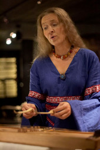

## Uli Kontu-Korhonen

Suomalainen sopraano Uli Kontu-Korhonen valmistui musiikin maisteriksi
Sibelius-Akatemiasta Helsingistä. Vanhaa musiikkia Kontu-Korhonen on
opiskellut mestarikursseilla opettajinaan mm. Evelyn Tubb, Michael
Fields, Stephen Stubbs, Suzie LeBlanc sekä The Hilliard Ensemblen
laulajat.

Uli Kontu-Korhosella on kuulaan kirkas sopraano, mikä helisee
enkelimäisiin korkeuksiin säilyttäen aina kauniin värinsä. Hän on
voimakas tulkitsija, joka laulaessaan kertoo tarinaa avoimesti yleisön
kanssa kommunikoiden.

Kontu-Korhosen soololevy "Praemia lucis Valon lahja" ilmestyi
toukokuussa v. 2008 Alba records -levy-yhtiölle ja se sisältää
Hildegard von Bingenin lauluja, vanhoja suomenkielisiä virsiä sekä
kansanlauluja. Soolo-ohjelmassaan Uli soittaa laulamisensa lisäksi
keskiaikaisia instrumentteja; dulcimer, sinfonia, portatiivinen urku
ja 5-kielinen kantele.

Uli Kontu-Korhonen on laulanut v.1997 lähtien keskiaikaisen musiikin
yhtye Oliphantin solistina. Yhtyeen ohjelmisto kattaa musiikkia
1100-luvun monodiasta moniääniseen ars novaan asti. Oliphant on tuonut
runsaasti julki ennestään tuntematonta truveerimusiikkia. Yhtyeen
levyt "Joie fine"-chansons pieuses-lauluja 2006, Gace Brulén musiikkia
sisältävä levy 2004 sekä "Lauluja Ristiretkiltä" 2000 ovat herättäneet
ihastusta niin yleisössä kuin arvostelijoissakin improvisatorisella ja
värikkäällä musisoinnillaan. Vuosien 2008-2009 aikana Oliphant
perehtyi saksalaiseen keskiaikaiseen musiikkiin sekä valmisti
ohjelmasta Herz, prich! – Sydän, murru! -konsertti- ja
levykokonaisuuden. Levy ilmestyi maaliskuussa 2010.

Omien soolokonserttiensa lisäksi Uli Kontu-Korhonen on ollut
toteuttamassa keskiaikaista liturgista draamaa, Ludus Danielis, sekä
Hildegard Bingeniläisen Ordo Virtutum-näytelmää. Kontu-Korhonen on
toiminut muusikkona useissa teatteri- ja tanssiproduktioissa, joissa
keskiaikainen musiikki on ollut keskeisessä asemassa. Keskiajan,
renessanssin ja barokkimusiikin esittämisen lisäksi Kontu-Korhonen on
laulanut myös jazz- ja kansanmuusikoiden kanssa sekä esittänyt uutta
musiikkia. Erilaiset poikkitaiteelliset produktiot ovatkin tärkeä osa
Uli Kontu-Korhosen taiteilijapersoonaa. Kotimaansa lisäksi hän on
konsertoinut useissa Euroopan maissa sekä tehnyt radionauhoituksia.

Uli Kontu-Korhonen opettaa vanhaa musiikkia Turun musiikkiakatemiassa
(Taideakatemia, Turun ammattikorkakoulu).  Suomen kulttuurirahasto on
myöntänyt Kontu-Korhoselle vuoden apurahan 2005 sekä kolmen vuoden
apurahan taiteelliseen työskentelyyn vuosina 2006-2009. 

Lisää: <a
href="http://www.ulikontukorhonen.com">www.ulikontukorhonen.com</a>
