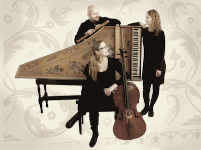

## Barokkiyhtye Cornucopia

- Pekka Silén, nokkahuilu
- Marianna Henriksson, cembalo
- Louna Hosia, barokkisello

Barokkiyhtye Cornucopia (lat. *runsaudensarvi*) on perustettu vuonna
2009; sen soittajat ovat soittaneet eri yhteyksissä yhdessä jo useiden
vuosien ajan.  Yhtyeen ohjelmisto kattaa barokin eri kansallisten
tyylien lisäksi renessanssin, varhaisklassismin ja 1900–2000-lukujen
musiikkia. Yhtyeen tavoitteena on luoda konserttikokonaisuuksia,
joissa ohjelmiston eri tyyleillä ja kokoonpanon vaihteluilla luodaan
niin jännittäviä kontrasteja kuin myös synteesejä.

Vuosina 2010–2011 yhtye on konsertoinut eri puolilla Suomea
ohjelmalla: ”SanatOn – puhuvaa musiikkia ilman puhetta”. Kesästä 2012
alkaen yhtye konsertoi myös uudella ohjelmalla ”Georg Philipp & Johann
Sebastian”, yhdessä sopraano Anna Brummerin kanssa.
