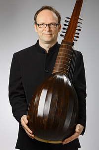

## Eero Palviainen

Nuori kitaranasoitonopiskelija Eero Palviainen otti käteensä
barokkiluutun ensi kertaa noin 30 vuotta sitten. Rakkaus soittimeen ja
sen sointiin syntyi heti. Hän opiskeli silloin Turun konservatoriossa,
josta hän siirtyi Sibelius-Akatemiaan, opettajanaan Leif Karlson.
Vuonna 1987 Palviainen jatkoi opintojaan Hopkinson Smithin johdolla
Baselin konservatoriossa, Schola Cantorum Basiliensissä. Diplomin
Palviainen suoritti vuonna 1992. Sen jälkeen vanha musiikki on
kuljettnut soittajaa ympäri maailmaa mitä erilaisimmissa yhtyeissä,
sooloresitaaleja unohtamatta.

Hänen ohjelmistonsa ulottuu renessanssista barokkiin; soittimina
renessanssiluuttu, vihuela, arkkiluuttu, teorbi, barokkikitara ja
barokkiluuttu. Hän soittaa tällä hetkellä muun muassa yhtyeissä
L’Arpeggiata (Ranska), Arte Suonatore Posnan (Puola), Battalia,
Suomalainen barokkiorkesteri ja Helsingin barokkiorkesteri. Eero on
kurkistanut myös luutun sisälle luutunrakentajana.