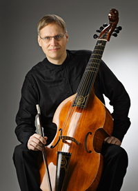

## Mika Suihkonen

Sellonsoiton opettaja Csaba Szilvay sytytti Mikassa rakkauden
klassiseen musiikkiin 1970- luvulla ja vaikutti ratkaisevasti siihen,
että kontulalaisesta koripalloilijasta tuli muusikko.

Helsingin Juniorijouset, Helsingin Kamarijouset ja Sibelius-lukio
vaikuttivat monin tavoin siihen, millaiseksi Mikan muusikkopersoona
muokkautui. Lukioajan ystävien kanssa perustettu vanhan musiikin yhtye
Battalia on yhä Mikan tärkein foorumi musiikissa, ja sen jäsenet
merkittäviä tekijöitä hänen kehityksessään soittajana. Opettajista
tärkeimpiä ovat Szilvayn lisäksi olleet Sarah Cunningham, Andrew
Lawrence-King ja Wieland Kuijken. Mika suoritti gambansoiton
diplomitutkinnon Sibelius-Akatemiassa vuonna 1993, piti
ensikonserttinsa vuonna 1999 ja valmistui musiikin maisteriksi
vuonna 2002. Hänen ensimmäinen soololevynsä La Gamba ilmestyi
syyskuussa 2010.

J.S. Bach, Monteverdi, Purcell, Charpentier, Buxtehude, Schütz, Tunder
ja Bruhns ovat Mikan lempisäveltäjiä, uudemmasta musiikista Brahms,
Richard Strauss, Bártòk ja Shostakovits. Hän ihailee suomalaisia
jazzmuusikoita, rakastaa rockabillyä ja doowopia, mutta jos hänet
pakotettaisiin valitsemaan musiikkia autiolle saarelle, hän päätyisi
Bachin kantaatteihin.

Mikalla on neljä soitinta ja kolme jousta: viola da gamba (Guy Derat
1990), barokkisello (Ilkka Vainio 1996), violone (Bastian Muthesius
1991) ja tenorigamba (Wang 2008). Jouset on tehnyt Luis Emilio
Rodriguez.

