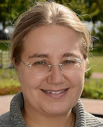

## Pilvi Listo

Pilvi Listo aloitti pianolla opintonsa Turun konservatoriossa Tarmo
Huovisen johdolla. Teini-iässä Listo ihastui cembaloon ja vaihtoi
soitinta, Sibelius-Akatemian nuorisokoulutuksessa häntä opettivat
Anssi Mattila ja Elina Mustonen, jonka johdolla Listo suoritti myös
akatemialla Cembalonsoiton A-tutkinnon erinomaisin arvosanoin vuonna
2002.

Urkujensoittoa Listo opiskeli aluksi Erkki Alikosken ja myöhemmin
Helsingissä Olli Porthanin johdolla, A-tutkinto uruista valmistui
keväällä 2006, sekin erinomaisin arvosanoin.

Ensikonserttinsa molemmista soittimistaan Listo soitti helmikuun
alussa 2009, teemana Frescobaldin musiikki.

Listo esiintyy aktiivisesti kamarimuusikkona, eri orkestereiden
riveissä ja omin konsertein. Keväällä Listo esiintyi Turun
kaupunginorkesterin muusikoiden kanssa vanhan musiikin konsertissa
Kankaisten kartanossa 19.5. Helsingin urkukesän konsertti oli 17.6.
15.8. Listo soittaa Helsingin saksalaisessa kirkossa uuden
urkupositiivin vihkiäiskonsertissa solistina mm. Händelin
urkukonserton op.4 nro 4 yhdessä Storia-yhtyeen kanssa.