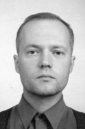

## Samuli Saarela

 Samuli Saarela (s. 1973) on opiskellut urkujensoittoa
Sibelius-Akatemiassa Markku Heikinheimon johdolla vuosina 2001-2005.
Nyt hän työskentelee Imatralla Tainionkosken kirkon 
kanttorina. Hän on valmistunut myös musiikinopettajaksi Jyväskylän
yliopistosta vuonna 2004.

Saarelan pitkäikäisimmät vanhan musiikin kokoonpanot ovat Fiamma
Lucente (cembalo) ja [Sonus Borealis](../sonus-borealis/) (luuttu, puhaltimet).
