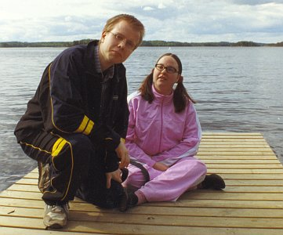

## Johannes Vesterinen

Johannes Vesterinen (s. 1979) valmistui musiikin maisteriksi Sibelius-Akatemian kirkkomusiikin osastolta syksyllä 2003. Tällä hetkellä hän toimii Imatrankosken kirkkoalueen kanttorina. Hän on opiskellut urkujensoittoa Olli Porthanin ja Markku Mäkisen johdolla, sekä sävellystä Jukka Tiensuun ja Harri Viitasen johdolla. Cembalonsoitonopettajana hänellä oli Anssi Mattila. Urkuimprovisaatiosta hän suoritti ylimmän tutkinnon erinomaisella arvosanalla. Vesterinen on osallistunut myös lukuisille mestarikursseille.

Kaakkois-Suomen taidetoimikunta valitsi Vesterisen Vuoden nuoreksi taiteilijaksi vuonna 2004. Imatran Taidepalkinnon hän sai vuonna 2005. Vesterinen on menestynyt lukuisissa kansallisissa sävellyskilpailuissa ja monia hänen kuoro- ja orkesterisovituksiaan on julkaistu äänitteillä. Vesterisen sävellystuotanto (yli 60 teosta) koostuu kamari-, orkesteri-, kuoro- ja urkumusiikista. Vesterisen sävellystyyliä voisi luonnehtia atonaalis-vapaatonaaliseksi.

Hän on konsertoinut urkurina ja cembalistina eri puolilla maatamme paitsi solistisesti, myös kamari- ja orkesterimuusikkona. Vuonna 1999 perustamassaan ja johtamassaan vanhan musiikin laulu- ja soitinyhtye Sonus Borealiksessa hän soittaa myös erilaisia renessanssin ajan puhaltimia. Yhtye julkaisi ensilevynsä elokuussa 2008.

## Heini Vesterinen

Heini Vesterinen (s. 1977) valmistui helmikuussa 2006 Helsingin ammattikorkeakoulu Stadiasta musiikkipedagogiksi erikoistumisalanaan vanha musiikki. Hänen instrumenttejaan ovat barokkiviulu, viulu, viola da gamba sekä erilaiset kosketinsoittimet.

Heini on esiintynyt mm. vanhan musiikin yhtyeiden Opus X:n ja Sonus Borealiksen sekä Kuudennen kerroksen orkesterin riveissä.

Vesterinen toimii laajalti erilaisissa opetustehtävissä ja kuoronjohtajana etenkin lasten ja nuorten parissa. Hän on voittanut useita kansanmusiikkikilpailuja ja hänellä on takanaan lukuisia kantaesityksiä, levytyksiä ja radiointeja. Suomen lisäksi Heini on esiintynyt Ruotsissa, Norjassa, Unkarissa ja Ranskassa.