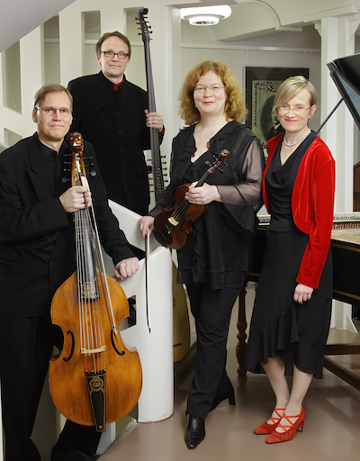

## Battalia

- Sirkka-Liisa Kaakinen-Pilch, viulu
- Susanne Helasvuo, viulu
- Mika Suihkonen, viola da gamba
- Eero Palviainen, luuttu
- Annamari Pölhö, urut ja cembalo

Helsinkiläinen Battalia perustettiin 1989, joskin sen jäsenet ovat
soittaneet yhdessä jo opintojensa alusta alkaen. Battalian rungon
muodostaa kaksi viulua, gamba, teorbi ja cembalo, mutta yhtyeen
kokoonpano muovautuu esitettävien teosten mukaan.

Battalia on konsertoinut ahkerasti eri puolilla Suomea ja sen
lisäksi Englannissa Saksassa, Eestissä, Hollannissa, Tanskassa,
Egyptissä ja Puolassa. Sen yhteistyökumppaneihin ovat kuuluneet
kotimaisten barokkilaulajien ja instrumentalistien lisäksi mm. Sarah
Cunningham, David Cordier, Andrew Lawrence-King ja Kuijkenin
veljekset.

Battalian jäsenet näkyvät myös Avanti!- ja Kuudes kerros
-orkestereiden riveissä sekä erilaisissa barokkiyhtyeissä ympäri
Eurooppaa. Battalian ensimmäinen levy *Italian Early Baroque*
(ABCD 112) voitti Yleisradion Vuoden levy- ja Janne-palkinnot. Yhtyeen
muut levyt ovat englantilaista musiikkia sisältävä *A Battle and No
Battle* (ABCD 139) sekä kokonaislevytys G.Ph.Telemannin Essercizii
Musici -kokoelmasta (ABCD 180-1).