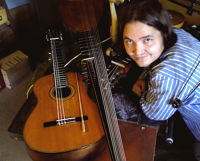

## Tuukka Terho

Tuukka Terho (s. 1979) on opiskellut kitaran soitantaa Turun
konservatoriossa ja Sibelius-Akatemiassa oppainaan Timo Korhonen,
Jukka Savijoki, Jyrki Myllärinen ja Ismo Eskelinen. Turussa hän aloitti
myös luutunsoitto-opinnot Eero Palviaisen johdolla. Kiinnostus uutta
musiikkia kohtaan johti myös sävellysopintoihin Sibelius-Akatemiassa
Jyrki Linjaman ja Tapio Nevanlinnan ohjauksessa. Tuloksena useampi
elokuvasävellysoperaatio joista viimeisin 2009 ”Elämää Kerroksissa”
(Inhale/Exhale) dir. Jean Counet.

Luutunsoittoa Tuukka on opiskellut myös Bremenissä Stephen
Stubbsin kisällinä. Kamarimuusikkona hän on esiintynyt erinäisissä
barokkimusiikkiin erikoistuneissa yhtyeissä ja on ollut mukana mm. Frank
Zappan musiikkia barokki-instrumentein soittavan Ensemble
Ambrosiuksen toiminnassa. Laulutaitoa hänelle on opettanut Ulla
Paakkunainen. Lauluaskareita on ollut mm. Savonlinnan
Oopperajuhlakuorossa sekä Opus X -barokkiorkesterin ja Markus
Malmgrenin kanssa tenorisolistina ja kuorolaisena. Johannes Vesterisen
luotsaama Sonus Borealis on tullut tutuksi milloin tenorin, Juudaksen,
citternistin, arkkiluutun näppäilijän ja minkä milloinkin rooleissa.

