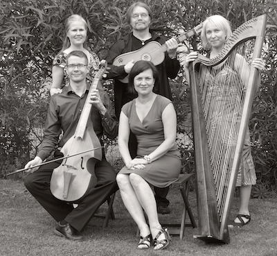

## Zephiro

- Ulla Paakkunainen, sopraano
- Eva Palviainen, goottilainen harppu, barokkiharppu
- Timo Peedu, vihuela da mano, barokkikitara
- Päivi Vesalaiuen, spinetti
- Ville Voipio, viola da arco, viola da gamba

Vanhan musiikin yhtye Zephiron perustivat vuonna 2009 sopraano Ulla Paakkunainen, gambisti Ville Voipio sekä luutisti Timo Peedu, joka toimii myös taiteellisena johtajana. Zephiro esittää musiikkia myöhäiskeskiajalta varhaisbarokkiin. 
Yhtye on kasvanut vuosien myötä ja kokoonpanossa on enimmillään yhdeksän muusikkoa.
