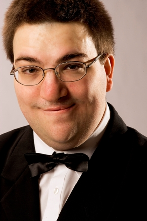

## Ilpo Laspas

Ilpo Laspas on monipuolinen muusikko joka esiintyy niin cembalistina ja urkurina kuin harvinaisempien soittimen kuten Omniwerkin soittajana. Aloitettuaan pianonsoitolla ja opiskeltuaan Sibelius-Akatemian nuoriso-osastolla cembaloa ja urkuja hänet hyväksyttiin Sibelius-Akatemian solistiselle osastolle kaikilla kolmella soittimellaan. Hän on suorittanut diplomit cembalolla, uruilla ja basso continuo -soitossa, ja suorittanut musiikin tohtorin tutkinnon aiheenaan Johann Sebastian Bachin musiikin tulkitsemisen eri ulottuvuuksia uruilla ja cembalolla.

Laspas on menestynyt useissa kilpailuissa, mm. toinen palkinto sekä yleisöpalkinto kansainvälisessä Johann Sebastian Bach -cembalokilpailissa Leipzigissa 2006 ja toinen palkinto saman kilpailun  urkusarjassa 2008. Hän on myös saavuttanut useita kunniamainintoja ja stipendejä. Hän on levyttänyt cembalolla, uruilla ja Omniwerkillä, ja konsertoi ahkerasti solistina ja kamarimuusikkona Suomessa ja ulkomailla.