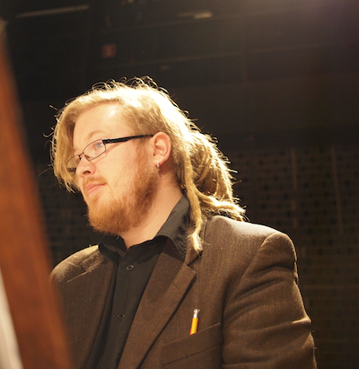

## Matias Häkkinen

Matias Häkkinen on maamme kiinnostavimpia ja aktiivisimpia kosketinsoittajia, keskeinen vaikuttaja ja läsnäolija musiikin kentillä. Hänet tunnetaan sekä vahvana visionäärinä että inspiroituneena soittajana ja omistautuneena opettajana.

Häkkinen työskentelee monipuolisesti erilaisissa muusikon tehtävissä sekä cembalistina että pianistina ja urkurina ohjelmistolla, joka ulottuu renessanssista kaikkein tuoreimpaan nykymusiikkiin. Erityisen kiinnostuksen kohteina hänellä ovat 1600-luvun loppupuolen orkesteri- ja cembalorepertuaarit sekä 1900-luvun alkupuolen vanhojen soitinten kulttuuri. Hän on konsertoinut ympäri Suomea sekä laajasti ympäri Eurooppaa mm. sooloresitaalein, kamarimuusikkona, lied-pianistina, säestäjänä, korrepetiittorina, orkesterin johtajana, solistina sekä jäsenenä, ja toimii kirjoittajana, pedagogina ja luennoitsijana, virittäjänä, huoltajana, tuottajana, sekä erilaisissa musiikin alan asiantuntijatehtävissä - ja on saanut oppia näissä töissä toimiessaan monia soittotaidon ja musiikillisen sivistyksen lisäksi hyödyllisiä taitoja, kuten kirjanpitoa, tapahtumatuottamista, johtamista ja markkinointia.

Häkkinen on toiminut New Century Baroque -orkesterin sekä Ensemble Nylandian taiteellisena johtajana. Lisäksi hän on soittanut mm. European Union Baroque Orchestrassa, European Union Chamber Orchestrassa, Suomalaisessa barokkiorkesterissa, BRQ Vantaa Ensemblessä, Radion sinfoniaorkesterissa, Laivaston soittokunnassa, Kaartin soittokunnassa ja Avanti!:ssa, Opus X -orkesterissa, Suomen kansallisoopperassa, sekä useiden kaupunginorkesterien kanssa. Esiintymisiä hänellä on ollut myös monilla Suomen ja Euroopan tunnetuimmista ja korkeatasoisimmista festivaaleista. Häkkinen on toiminut myös Helsingin ammattikorkeakoulussa (Metropolia), Sibelius-Akatemiassa, Sibelius-lukiossa ja Helsingin konservatoriossa, monissa musiikkiopistoissa sekä lukuisilla mestarikurseilla säestäjänä ja cembalonsoiton, basso continuon sekä kamarimusiikin opettajana. Hän on myös Café Barock -konserttisarjan taiteellinen johtaja ja tuottaja.

Vuonna 2011 Häkkinen päätti opintonsa musiikin maisterin tutkintoon. Matkan varrella hän opiskeli pianon- ja cembalonsoittoa mm. Anssi Mattilan, Menno van Delftin, Seppo Saloviuksen, Joonas Pohjosen, Ana Mafalda Castron ja Annamari Pölhön johdolla Sibelius-Akatemiassa, Stadiassa, sekä Amsterdamissa ja Portossa. Opintojaan hän on täydentänyt mm. Gustav Leonhardtin, Ton Koopmanin, Laurence Dreyfusin, Pierre Hantaïn, Bob van Asperenin, Huguette Dreyfusin ja Andrew Lawrence-Kingin antoisilla mestarikursseilla.

Hänen uraansa ovat vuosien varrella apurahoin ystävällisesti tukeneet mm. Alfred Kordelinin yleinen edistys- ja sivistysrahasto, Musiikin edistämissäätiö, Pro Musica -säätiö sekä Taiteen edistämiskeskus. Vuonna 2015 hän työskenteli erityisesti Frobergerin soolocembalomuusikin parissa valtion puolivuotisen apurahan turvin.