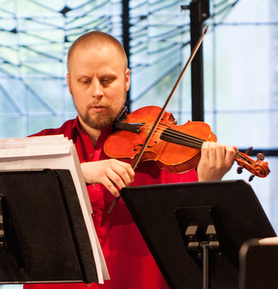

## Petri Tapio Mattson

Barokkiviulisti Petri Tapio Mattson on tullut vanhan musiikin yleisöille tutuksi mm. perustamansa Opus X -yhtyeen taiteellisena johtajana, Kuudennen kerroksen orkesterin (nyk. Suomalainen barokkiorkesteri) konserttimestarina (2000-2006), Helsingin barokkiorkesterin ja useiden muiden kotimaisten vanhan musiikin kokoonpanojen jäsenenä, kamarimuusikkona ja solistina.

Hän on tehnyt useita kotimaisessa vanhan musiikin kentässä uraauurtavia konserttiesiintymisiä ja levytyksiä; levytyksillään hän on ansainnut useita kunniamainintoja kansainvälisesti ja Emma-ehdokkuuden parhaaksi kotimaiseksi klassisen musiikin levytykseksi vuonna 2012. Hän on esiintynyt useimmissa Länsi- ja Keski-Euroopan maissa.