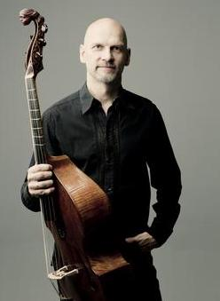

## Markku Luolajan-Mikkola

 Markku Luolajan-Mikkolan soittimia ovat erilaiset viola da gambat ja historialliset sellot. Hänen ohjelmistonsa ulottuu 1500-luvun musiikista meidän aikaamme sisältäen vaativimpia kyseisille soittimille sävellettyjä kappaleita. Hän on esiintynyt resitaali- ja kamarimusiikkona 1990-luvulta lähtien. Uransa aikana hän on soittanut yli 1000 konserttia yli 30:ssä maassa. Ranskalaiseen barokkimusiikkiin keskittyvä hyvin laaja Gambaa-konserttisarja sai Yleisradion “Vuoden musiikkiteko” palkinnon 2003. Luolajan-Mikkola on kantaesittänyt yli kymmeniä sävellyksiä, joista suurin osa on hänen tilaamiaan. Hänen käsityksensä mukaan historiallisten soittimien tulevaisuutta ei pitäisi rajata kuolleiden säveltäjien musiikkiin, vaan uudella musiikilla voidaan lisätä ymmärrystä meidän ajastamme ja uudistaa soittimen ilmaisumahdollisuuksia. Hän perusti vanhaan musiikkiin keskittyvän BRQ Vantaa Festivaalin vuonna 2010, jonka taiteellisena johtajana hän toimii edelleen. 

Vuosina 2015-2017 Luolajan-Mikkolalla on Suomessa meneillään kaksi merkittävää konserttisarjaa. Hän esittää viola da gamballa Sibelius-Akatemian “Soiva akatemia” -konserttisarjassa viisi erilaista ohjelmaa Marin Marais’n ja Antoine Forquerayn musiikkia. Peregrina†io-kiertueella Luolajan-Mikkola soittaa barokkisellolla Johann Sebastian Bachin soolosello- ja sooloviuluteoksia kaikissa Suomen keskiaikaisissa kivikirkoissa. Phantasm gambayhtyeensä kanssa hän konsertoi Euroopan lisäksi Yhdysvalloissa, Meksikossa ja Uudessa-Seelannissa. 

Luolajan-Mikkola on levyttänyt runsaasti: Soolo- ja kamarimusiikkilevytyksiä on kertynyt liki 50. Hänen soololevyjään on huomioitu Janne- ja Emma palkinnoilla sekä Yleisradion tunnustuspalkinnolla. Hän on perustajajäsen Phantasm gambayhtyeessä, jolle on kahdesti myönnetty kahdesti Gramophone-palkinto sekä lukuisia muita tunnustuksia, mm. Diapason d’Or, Gramophonen Editor’s Choice, Choc du Monde de la Musique sekä BBC Music Magazinen ja Rondo-lehden Kuukauden levy -maininnat. Australialaisen Limelight-lehti valitsi Phantasmin William Lawes'n Royal Consorts tupla-CD:n vuoden 2015 parhaaksi kamarimusiikkilevytykseksi. 

Luolajan-Mikkola on opettanut Sibelius-Akatemiassa ja muissa musiikkioppilaitoksissa 70-luvulta lähtien. Alkuun hän opetti vain sellonsoittoa, mutta nykyisin opetus on painottunut viola da gamban- ja barokkisellonsoittoon.