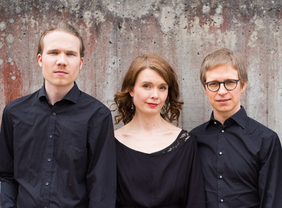

## Ensemble Gamut!

- Aino Peltomaa, sopraano, harppu, perkussiot
- Ilkka Heinonen, jouhikko, g-violone
- Juho Myllylä, nokkahuilut, elektroniikka

Ensemble Gamut! on tuore, vanhan musiikin ja kansanmusiikin ammattilaisista koostuva kollektiivi, joka etsii rohkeasti uusia tapoja tuoda vanhaa musiikkia tämän päivän kuulijoille, yhdistäen vanhaa musiikkia, kansanmusiikkia, elektroniikkaa sekä vapaata improvisaatiota. Syvällinen tyylilajien tuntemus, mutta toisaalta myös rajoja rikkova genrejen ylitys ja halu kokeilla uutta yhdistää ensemblen muusikoita, ja tämä saakin aikaan hurjia uudenlaisia äänimaailmoita. 

Konserttikokonaisuudessa “Jay pris amours - olen valinnut rakkauden” yhdistämme keskiajan sävelmiä, 1300–1400-lukujen “courtly love” -tematiikkaa suomalaisiin kansanlauluihin rakkaudesta, sen eri ilmenemismuodoissa. Konsertin kantava teema, sävelmä ja runo ”J´ay pris amours” oli paljon matkustanut, varioitu ja käytetty “hitti”, ja se löytyy edelleen puuhun kaivettuna pienestä kappelista Urbinosta, Italiasta. 

Useat konsertin sävelmät löytyvät myös Chansonnier Cordiformesta, joka on Jean de Monntchenun tilaama harvinaislaatuinen sydämen muotoinen nuottikokoelma. Kokoelma on erittäin värikkäästi ja taidokkasti kuvitettu.

Kaukainen rakkaus, courtly love, katkera entisen rakastajan kohtaaminen, suru, himo, kaipuu, katkeruus  ja menetys ovat teemoja jotka yhdistävät toisaalta 1300-1400 luvun tekstejä ja suomalaisia kansansävelmiä ja runoja rakkaudesta. Kuulemme myös varhaiskeskiajan sävelmiä kokoelmasta “Cantiga de amigo” sekä “Musica Britannica”.

