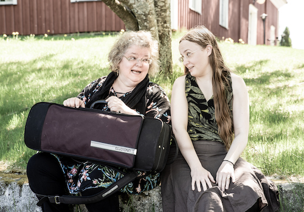

## Kreeta-Maria Kentala ja Tea Polso

- Kreeta-Maria Kentala, barokkiviulu
- Tea Polso, cembalo

Kreeta-Maria Kentala ja Tea Polso ovat muusikoita, jotka kaustislaisten pelimannisukujuuriensa ansiosta ovat pienestä pitäen päässeet kansanmusiikin vaikutuspiiriin. Pelimannisoitto on seurannut mukana läpi elämän, vaikka molemmat työskentelevät klassisen musiikin ammattilaisina. He ovat molemmat asettuneet asumaan Keski-Pohjanmaalle, josta käsin nykyään organisoivat vilkasta muusikonelämäänsä.

Kreeta-Maria Kentala on opiskellut viulunsoittoa Sibelius-Akatemiassa ja Edsbergs musikinstitutissa Tukholmassa sekä barokkiviulunsoittoa Hilversumin taidekorkeakoulussa. Hän toimii vapaana taiteilijana liidaten orkestereita ja esiintyen kamarimuusikkona ja solistina. Tea Polso on valmistunut Sibelius-Akatemian vanhan musiikin ja kirkkomusiikin koulutusohjelmista. Hän on toiminut sekä kanttorina että konsertoivana muusikkona, työskennellen tätä nykyä cembalistina erilaisissa kokoonpanoissa sekä tuntiopettajana.

