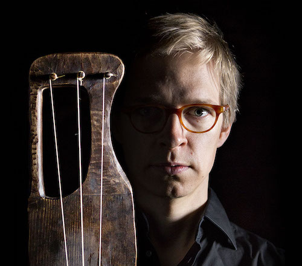

## Ilkka Heinonen

Ilkka Heinonen on helsinkiläinen kansanmusiikkiin ja maailmanmusiikkiin erikoistunut muusikko ja säveltäjä, soittiminaan jouhikko, kontrabasso, violone ja viola da gamba. Euroopan kansanmusiikkikulttuureista vaikutteensa saaneiden yhtyeiden lisäksi Heinonen on toiminut niin solistina kuin orkestereissa nykymusiikin ja vanhan musiikin konserteissa sekä projekteissa.

Yhtenä jouhikonsoiton edelläkävijöistä Heinonen on pyrkinyt laajentamaan instrumentin käyttömahdollisuuksia: Soolo-ohjelmistossaan Heinonen tutkii pyhän ja maallisen rajapintoja karjalaisen jouhikkomusiikin ja vanhan musiikin esittämiskäytännöistä käsin. Ilkka Heinonen Trion kokeellinen sointi on saanut vaikutteensa niin eurooppalaisesta jazzista kuin renessanssin musiikistakin (Albumit Savu 2015 ja Lohtu 2021). Heinonen soittaa jouhikkoa ja violonea kokeellisen vanhan musiikin yhtyeessä Ensemble Gamut (UT 2020, RE 2022), jouhikkokvartetti Jouhiorkesterissa, saamelaislaulaja Ánnámáretin yhtyeessä (Nieguid duovdagat 2021) sekä useassa tilapäisemmässä kamarimusiikkikokoonpanossa. Ilkka Heinonen kantaesittänyt kaikki tähän asti jouhikolle sävelletyt konsertot (Page 2013, Nagaraja 2017) sekä soittanut jouhikollaan solistisissa tehtävissä RSO:n, Caput Ensemblen (IS), Uusinta-kamariorkesterin, Avantin, Sibelius–Akatemian barokkiorkesterin, Haapaveden kamariorkesterin ja Nefesin konserteissa ja levytyksissä.

Heinosen monimuotoista kontrabasson ja violonen soittoa voi kuulla useilla levyillä sekä konserteissa – erityisesti pohjoismaista ja Itä-Europan kansanmusiikkia esittävissä kokoonpanoissa, nykytanssiproduktioissa sekä eri barokkiyhtyeiden riveissä.

Heinonen viimeistelee taiteellista tohtorintutkintoansa ”Kansansoittajat palatseissa – Muusikon ilmaisun kehittyminen historiallisten konventioiden kautta” Sibelius–Akatemian MuTri-tohtorikoulutusohjelmassa. Taiteelliseen kokonaisuuteen kuuluvat konsertit ”Ladogan joutzicandele-cuningat” (2016), ”Basso ostinati per lo Jouhikko” (2018) ja ”Karjalan pyhien kaiut” (2020) sekä soolojouhikkoäänite ”Käki” (2023). 