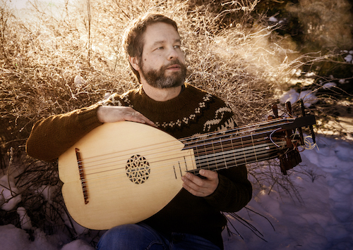

## Mikko Ikäheimo

Mikko Ikäheimo on musiikin maisteri kitarassa ja luutussa. Hänet tunnettiin aiemmin nimenomaan klassisen kitaran soittajana, mutta viime vuosina hän on keskittynyt luuttuihin ja muihin historiallisiin näppäilysoittimiin.

Continuo- ja yhtyesoiton ohella Mikko esiintyy myös soolokonserteissa. Muutama vuosi sitten  julkaistiin Mikon uusin CD, joka on tehty Pietari Brahen luuttukirjan ohjelmiston pohjalta.