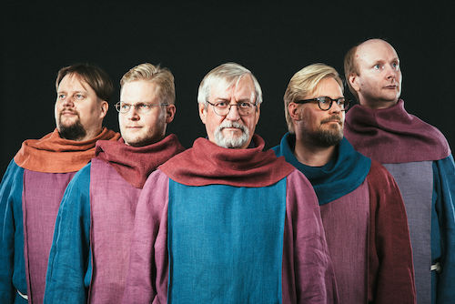

## Schola Sancti Henrici

(Kuva: Aleksi Kallioja)

Vuonna 2000 perustettu gregoriaaninen lauluyhtye Schola Sancti Henrici on esittänyt Pyhän Henrikin messun ja vesperin useasti eri puolilla Suomea. Pyhän Henrikin päivänä vuonna 2001 yhtye lauloi messun keskeiset osat Rooman Santa Maria Sopra Minerva -basilikassa vietetyssä ekumeenisessa messussa, ja samalla matkalla se esiintyi myös paavin vastaanotolla Vatikaanissa.

Myöhemmin yhtye on esiintynyt Portugalissa, Virossa, Ruotsissa ja Kreikassa, useita kertoja Puolassa sekä niin Kanariansaarilla kuin manner-Espanjassa. Schola Sancti Henrici on laajentanut ohjelmistoaan pääosin Suomessa käytetyllä gregoriaanisella musiikilla sekä *Graduale Romanumin* aineistolla: yhtyeen ohjelmistoon kuuluvat myös Pyhään Henrikiin liittyvästä materiaalista koottu ohjelmakokonaisuus *Pyhän Henrikin legenda* sekä pitkänperjantain iltaan sopiva *Agios o Theos*. 

Schola Sancti Henricissä laulavat musiikin maisterit Jussi Hirvonen, Samuli Korkalainen, Samppa Laakso ja Vesa Mäkeläinen sekä teologian tohtori Hannu Vapaavuori. He kaikki ovat suorittaneet kirkkomuusikon tutkinnon Sibelius-Akatemiassa. Yhtye on julkaissut keväällä 2006 CD-äänitteen *Patronus Finlandie*, joka sisältää Pyhän Henrikin messun ja vesperin. Alkuvuodesta 2014 ilmestyi äänite *Pyhän Henrikin legendasta*.

