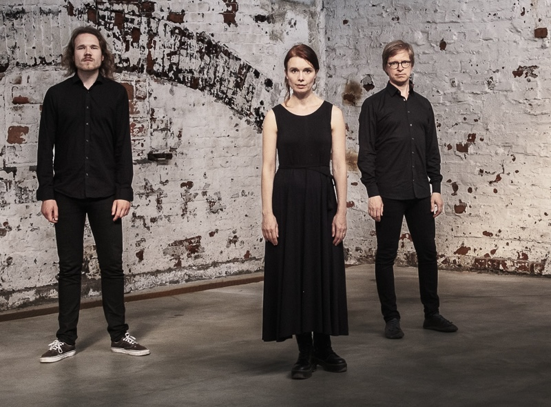

## Ensemble Gamut!

- Aino Peltomaa, sopraano, harppu, perkussiot
- Ilkka Heinonen, jouhikko, g-violone
- Juho Myllylä, nokkahuilut, elektroniikka

Aino Peltomaan luotsaama Ensemble Gamut! on noussut nopeasti yhdeksi Suomen kiinnostavimmista genrejen välimailla sulavasti liikkuvista yhtyeistä. Yhtye on luonut uniikin soundinsa yhdistämällä elementtejä keskiajan musiikista, suomalaisista kansansävelmistä, improvisaatiosta, omista sävellyksistä sekä elektronisista äänimaisemista. 

Eclipse Musicin joulukuussa 2022 julkaisema Ensemble Gamut!:n toinen levy ”RE” sai Emma -ehdokkuuden ja saanut osakseen laajaa kiinnostusta myös Suomen rajojen ulkopuolella sekä klassisen musiikin, vanhan musiikin kuin myös progressiivisen musiikin piireissä. 2020 julkaistu debyyttilevy ”UT” sai Suomen vanhan musiikin liiton “Vuoden vanhan musiikin teko 2020” -tunnustuspalkinnon. Levy valittiin myös YLE:n vuoden levy 2021 -ehdokkaaksi, ja oli The Progressive Aspect:n valitsemien vuoden parhaiden proge- levyjen joukossa. 

Ensemble Gamut! on esiintynyt laajalti niin klubikeikoilla, museoissa, keskiaikaisissa kirkoissa kuin konserttisaleissakin Suomen lisäksi Ruotsissa, Saksassa, Italiassa, Belgiassa ja Alankomaissa.