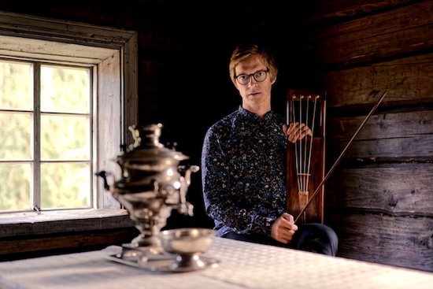

## Ilkka Heinonen

Ilkka Heinonen on helsinkiläinen kansanmusiikkiin ja maailmanmusiikkiin erikoistunut muusikko ja säveltäjä, soittiminaan jouhikko, kontrabasso, violone ja viola da gamba – intohimonaan vanha musiikki.

Yhtenä jouhikonsoiton edelläkävijöistä Heinonen on pyrkinyt laajentamaan instrumentin käyttömahdollisuuksia. Soolo-ohjelmissaan Heinonen tutkii pyhän ja maallisen rajapintoja karjalaisen jouhikkomusiikin ja vanhan musiikin esittämiskäytännöistä käsin, kuten soittimen sointia syväluotaavalla soolojouhikkoalbumillaan Käki (2023). Kaksi kiitettyä albumia (Savu 2015 ja Lohtu 2021) julkaissut Ilkka Heinonen Trio on saanut vaikutteensa kokeelliseen sointiinsa niin eurooppalaisesta jazzista kuin renessanssin musiikistakin. Heinonen on myös kantaesittänyt kaikki tähän asti jouhikolle sävelletyt konsertot (säv. Timothy Page 2013, Krishna Nagaraja 2017). 
 
Heinonen soittaa jouhikkoa Ensemble Gamut!issa, joka yhdistää elementtejä keskiajan musiikista, suomalaisista kansansävelmistä, improvisaatiosta sekä elektronisista äänimaisemista. Yhtyeen uniikkia sointia voi konserttien lisäksi kuulla albumeilla UT (2020) ja RE (2022). Saamelaislaulaja Ánnámáretin yhtye on vienyt Heinosen syvälle muinaisten luohtien, nykymusiikin ja elektronisesti muokatun jouhikkosoinnin maailmaan, kuten albumeilla albumit Nieguid Duovdagat (2021) ja Bálvvosbáiki (julk. 2024). Heinonen on myös konsertoitunut jouhikkokvartetti Jouhiorkesterin riveissä lukuisissa maissa Euroopasta Aasiaan. 
 
Ilkka Heinonen esiintyy aktiivisesti kontrabasistina ja violonensoittajana barokkiyhtyeiden riveissä sekä keikkailee erityisesti pohjoismaista ja Itä-Europan kansanmusiikkia esittävissä kokoonpanoissa. Heinonen työskentelee säännöllisesti myös nykytanssin ja musiikkiteatterin parissa.
 
Heinonen viimeistelee jouhikon ilmaisumahdollisuuksia käsittelevää taiteellista tohtorintutkintoansa Sibelius–Akatemian MuTri-tohtorikoulutusohjelmassa. 