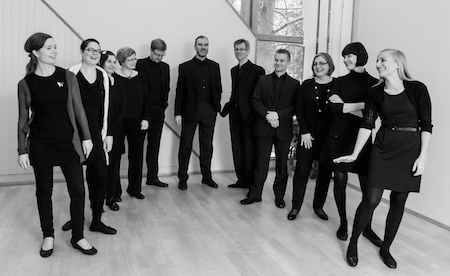

## Lauluyhtye Versio

Lauluyhtye Versio on vuonna 2003 perustettu vanhaan musiikkiin keskittyvä kokoonpano, jonka ohjelmiston ydintä rikastuttaa oman aikamme musiikki. Ohjelmistossa on ollut paljon muun muassa 1400–1600-luvuilla eläneiden Desprezin, Palestrinan, Victorian, Monteverdin ja Allegrin teoksia sekä 1900-luvulla syntyneiden Pärtin, Lauridsenin ja Tavenerin musiikkia.

Yhtyeen kokonaissointiin tuo oman värinsä mies- ja naisäänien yhdistäminen väliäänissä eli tenori- ja alttostemmoissa. Kesällä 2010 Versio teki kiertueen Iso-Britanniaan ja pääsi tuolloin aloittamaan yhteistyön laulaja ja vanhan musiikin spesialisti John Potterin kanssa. Kaustisen kamarimusiikkiviikolla 2012 Versio oli mukana ranskalaisen kapellimestarin Jean Tubéryn johtamassa messurekonstruktiossa, jonka painopiste oli Claudio Monteverdin vokaaliteoksissa. Heinäkuussa 2012 yhtye osallistui Karjaan vanhan musiikin kurssille, jossa sitä opetti Veikko Kiiver. Viime aikoina Versio on saanut ohjausta Kari Turuselta.

Eri puolilta Suomea tulevat laulajat ovat Mikko Eskelinen, Heikki Isotalo, Aino Jalkanen, Jarmo Lintamo, Minna Muukkonen, Anne Palo, Aino Peltomaa, Sampo Rantakokko, Hilkka Rauhala, Timo Turtiainen ja Kristiina Vähäkangas. Yhtyeen toimintaa ovat tukeneet Suomen Kulttuurirahasto ja ESEK.